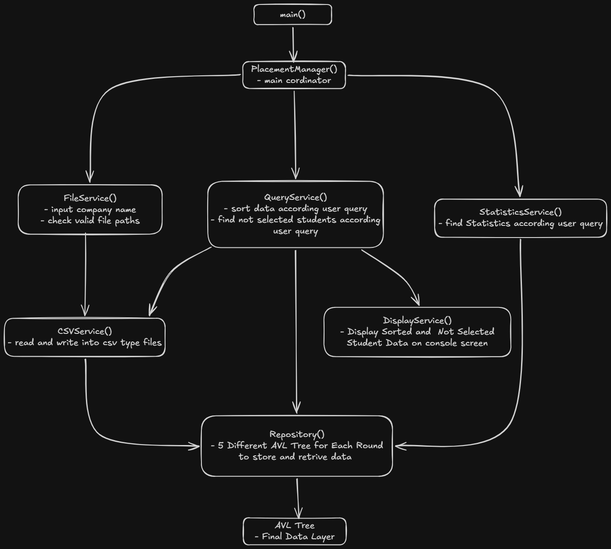

Your current README is good. I’d add the **Data Storage**, **Query/Filtering**, **Statistics**, **Not-Selected**, **How to Run**, **Sample Tests**, and **Technologies** sections after the Project Structure.

Here is the complete version:

````markdown
# DA-IICT Placement Manager

A C++ console application for managing and analyzing student placement data.

The system supports placement data loading, filtering, sorting, placement statistics, and finding students who were not selected.

## Features

- Load placement data from CSV files for Round 1, Round 2, Round 3, Round 4, and Final Round.
- Validate file paths before loading data.
- Store student records using AVL Trees.
- Filter students using multiple conditions such as batch, program, company, and year.
- Sort filtered placement records.
- Find students who were not selected.
- Generate placement statistics.
- Display results on the console.
- Export sorted data to CSV files.

## Architecture



The application is divided into separate components with specific responsibilities:

- `PlacementManager` — Coordinates the application.
- `FileService` — Manages the file loading and writing workflow.
- `CSVService` — Reads and writes CSV files.
- `QueryService` — Handles filtering, sorting, and not-selected student operations.
- `StatisticsService` — Calculates placement statistics.
- `DisplayService` — Displays results on the console.
- `Repository` — Provides access to placement data.
- `AVLTree` — Stores records using a self-balancing binary search tree.
- `Record` — Represents a student placement record.
- `Query` — Represents filtering conditions.
- `Statistics` — Stores placement statistics.

## Project Structure

```text
DA-IICT-Placement-Manager/
│
├── include/
│   ├── data/
│   │   └── Repository.h
│   │
│   ├── ds/
│   │   └── AVLTree.h
│   │
│   ├── io/
│   │   ├── CSVService.h
│   │   ├── DisplayService.h
│   │   └── FileService.h
│   │
│   ├── models/
│   │   ├── Query.h
│   │   └── Record.h
│   │
│   ├── services/
│   │   ├── QueryService.h
│   │   └── StatisticsService.h
│   │
│   └── PlacementManager.h
│
├── tests/
│   └── Sample CSV files
│
├── main.cpp
├── .gitignore
└── README.md
````

## Data Storage

The `Repository` maintains five AVL Trees, one for each placement round:

```text
Repository
│
├── R1  → Round 1
├── R2  → Round 2
├── R3  → Round 3
├── R4  → Round 4
└── FR  → Final Round
```

Each tree stores:

```cpp
AVLTree<long long, Record>
```

where:

* `long long` — Student ID used as the key.
* `Record` — Student placement information.

The AVL Tree maintains balance after insertion and supports efficient searching using the student ID.

## Query and Filtering

The `Query` class represents the conditions used to filter student records.

Example:

```cpp
Query q;

q.setBatch(2027)
 .setProgram("CSE")
 .setCompany("Google");
```

`QueryService` uses these conditions to retrieve matching records through the `Repository`.

Supported filters include:

* Student ID
* Batch
* Program
* Company
* Year

Multiple filters can be combined in a single query.

## Sorting

`QueryService` provides sorting operations based on different student attributes.

Examples include:

* Batch-wise sorting
* Program-wise sorting
* Company-wise sorting
* Year-wise sorting
* Batch and Program
* Batch and Company
* Program and Company
* Year and Batch
* Year and Program
* Year and Company

Sorted results can be displayed on the console or exported to a CSV file.

## Placement Statistics

`StatisticsService` calculates placement statistics based on the selected query and placement data.

The system supports:

* Overall placement statistics
* Batch-wise statistics
* Program-wise statistics
* Company-wise statistics
* Year-wise statistics
* Batch and Company statistics
* Batch and Program statistics
* Program and Company statistics
* Year and Batch statistics
* Year and Program statistics
* Year and Company statistics

Package-related statistics include:

* Minimum package
* Maximum package
* Average package
* Median package

## Not-Selected Students

The system can identify students who participated in the placement process but did not receive a final offer.

Not-selected students can be filtered using:

* Batch
* Program
* Company
* Year
* Multiple combined conditions

## How to Run

### 1. Clone the Repository

```bash
git clone https://github.com/WAYWIDN/DA-IICT-Placement-Manager.git
cd DA-IICT-Placement-Manager
```

### 2. Compile the Project

For Windows:

```powershell
g++ -std=c++17 -I include main.cpp -o main.exe
```

For Linux/macOS:

```bash
g++ -std=c++17 -I include main.cpp -o main
```

### 3. Run the Application

For Windows:

```powershell
.\main.exe
```

For Linux/macOS:

```bash
./main
```

## Loading Sample Tests

Sample CSV files are provided in the `tests` directory.

After running the application, select:

```text
1. Input Placement Data
```

Enter the company name and the paths of the corresponding CSV files.

For example:

```text
tests/Company1R1.csv
tests/Company1R2.csv
tests/Company1R3.csv
tests/Company1R4.csv
tests/Company1FR.csv
```

Use the actual filenames available in the `tests` directory.

The application validates all file paths before inserting any data. If any file path is invalid, no data is inserted.

After successful loading, the remaining menu options can be used to sort data, view statistics, and find not-selected students.

## Technologies and Concepts

* C++17
* Object-Oriented Programming
* Templates
* AVL Tree
* Vectors
* Sets
* Queues
* File I/O
* CSV Parsing
* Searching
* Sorting
* Tree Traversal
* Recursion
* Dynamic Memory Management
* Dependency Injection
* Separation of Responsibilities

## Author

Vivek Parmar

DA-IICT

````

One small thing: **make sure `docs/architecture.png` actually exists** in your repository. Your current screenshot showed `tests/`, but not `docs/`. If you haven't created `docs/` yet, create it and put your architecture image there:

```text
DA-IICT-Placement-Manager/
├── docs/
│   └── architecture.png
├── include/
├── tests/
├── main.cpp
└── README.md
````

Then this will render correctly on GitHub:

```markdown

```
